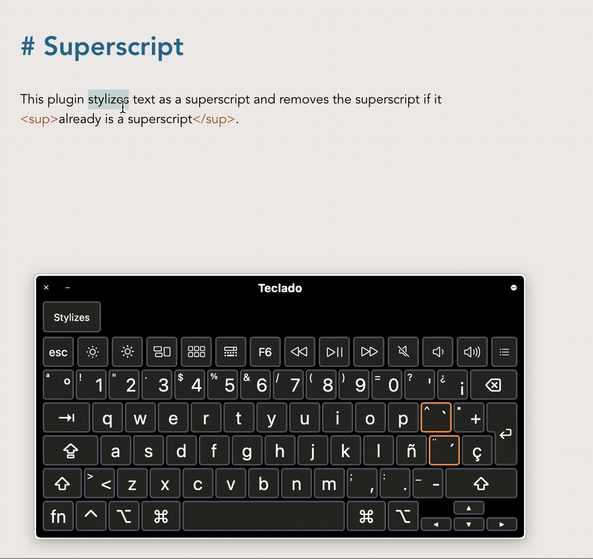

# Obsidian superscript

This is a fork from [Benature's obsidian-underline plugin](https://github.com/Benature/obsidian-underline).

Simiarly to Benature's, simply use the hotkey `cmd/ctrl+S` to add an superscript format to the selected text, which will render `content` (or `` when no selection). Additionally, the plugin will also undo the superscript when superscript text is selected.

## Changing hotkey
`cmd/ctrl+S` is the default hotkey to save the open note. To remove this hotkey and avoid conflict, go to **Settings** (`cmd/ctr+,`), head to the **Hotkeys** section in the sidebar and find the hotkey for 'Save current file', and either delete the hotkey or add a custom alternative (I have `⌥+s`).

## Demo

